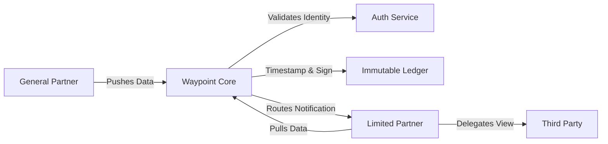

# Waypoint Architecture: The Clearinghouse Model

## High-Level Concept
Waypoint acts as a "Data Switch" or Clearinghouse. It does not "host files" in the traditional sense; it settles data transactions between entities.



---

## Data Structure: Envelope vs. Payload

To ensure reliability without creating high barriers to entry, we separate the routing logic from the data content.

### 1. The Envelope (Strict)
The "Header" of the transaction. Must pass strict validation for the packet to be accepted by the network.

```json
{
  "envelope_id": "uuid-v4",
  "publisher_id": "org_gp_001",
  "fund_id": "fund_iv_growth",
  "timestamp": "2025-11-27T10:00:00Z",
  "period": "2025-Q3",
  "data_type": "CAPITAL_CALL",
  "version": 1,
  "recipient_scope": "ALL_LPS" // or specific array of LP IDs
}
```

**Validation Rules:**
*   `publisher_id` must match the authenticated session.
*   `fund_id` must be registered to the Publisher.
*   `period` must follow ISO standards.

### 2. The Payload (Loose)
The "Body" of the transaction. Flexible to accommodate various GP internal formats.

```json
{
  "data": [
    {
      "lp_id": "lp_001",
      "amount": 500000.00,
      "currency": "USD",
      "due_date": "2025-12-15",
      "bank_account": "XX-1234"
    },
    {
      "lp_id": "lp_002",
      "amount": 1250000.00,
      "currency": "USD",
      "due_date": "2025-12-15",
      "bank_account": "XX-1234"
    }
  ]
}
```

**Validation Rules:**
*   Must be valid JSON syntax.
*   No schema enforcement in Phase 1 (e.g., `amount` vs `Amount` is ignored).

---

## System Components

### 1. Frontend (The Terminal)
*   **Stack:** React / Next.js
*   **Role:**
    *   **Publisher:** Data entry, envelope configuration, signing.
    *   **Subscriber:** Feed view, search, delegation management.
    *   **Admin:** Identity verification and system monitoring.

### 2. API Layer (The Switch)
*   **Stack:** Node.js / Python (FastAPI) / Go
*   **Role:**
    *   Authentication (OAuth/JWT).
    *   Envelope Validation.
    *   Routing logic.
    *   Webhook dispatch.

### 3. Storage Layer (The Vault)
*   **Database:** PostgreSQL (for relational data: Users, Orgs, Permissions).
*   **Object Storage / Blob Store:** S3-compatible (for the raw JSON payloads).
*   **Ledger:** An append-only table recording the hash of every payload + envelope combination.

---

## Security Model

1.  **Identity:** All actions are tied to a verified Organization Identity.
2.  **Immutability:** Once a `version` is committed, it cannot be changed. Updates are strictly `version + 1`.
3.  **Transport:** TLS 1.3 for all data in transit.
4.  **At Rest:** AES-256 encryption for stored payloads.

