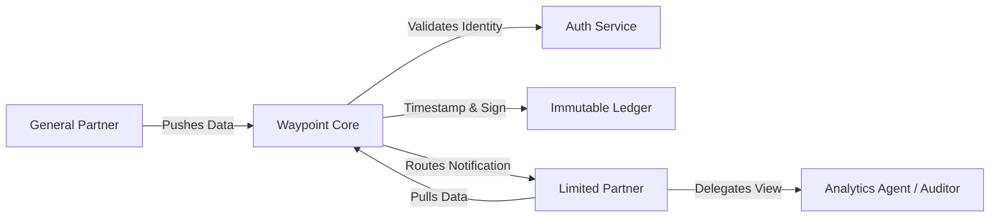

# Waypoint Architecture: The Clearinghouse Model

## High-Level Concept
Waypoint acts as a "Data Switch" or Clearinghouse. It does not "host files" in the traditional sense; it settles data transactions between entities.



---

## Data Structure: Envelope vs. Payload

To ensure reliability without creating high barriers to entry, we separate the routing logic from the data content.

### 1. The Envelope (Strict)
The "Header" of the transaction. Must pass strict validation for the packet to be accepted by the network.

```json
{
  "envelope_id": 1001001, // BigInt (Snowflake or Auto-Inc)
  "publisher_id": 5050, // Numeric ID for the entity publishing
  "user_id": 8812, // Numeric ID for the specific user
  "asset_owner_id": 2020, // Numeric ID for the Asset Owner (GP)
  "asset_id": 3001, // Numeric ID for the Asset (Fund/Co-Invest)
  "timestamp": "2025-11-27T10:00:00.000Z", // ISO 8601 UTC String (Strict)
  "version": 1,
  "recipient_id": 7001, // Numeric ID for the Recipient Entity (LP) - One envelope per recipient
  "status": "Delivered",
  "data_type": "CAPITAL_CALL" // Optional metadata
}
```

**Validation Rules:**
*   `publisher_id` must match the authenticated session's Organization.
*   `asset_owner_id` must have delegated publishing rights to `publisher_id`.
*   `timestamp` must be a valid ISO 8601 string in UTC (Z-terminated).
*   **One Envelope Per Recipient:** To allow for individual read receipts and granular permissions, a separate envelope is created for each LP recipient, even if the payload is identical.

### 2. The Payload (Loose)
The "Body" of the transaction. Flexible to accommodate various GP internal formats.

```json
{
      "currency": "USD",
      "due_date": "2025-12-15",
  "bank_details": { ... },
  "line_items": [
    {
      "lp_id": "3001",
      "amount": 500000.00
    }
  ]
}
```

**Validation Rules:**
*   Must be valid JSON syntax.
*   No strict schema enforcement in Phase 1 (e.g., `amount` vs `Amount` is ignored).

---

## Correction Workflow (Versioning)

Waypoint implements an append-only correction model to ensure auditability.

1.  **Immutability:** Original envelopes (v1) are never deleted or modified.
2.  **Correction Mode:** Publishers can enter "Correction Mode" for a specific envelope.
3.  **New Version:** The system creates a new envelope with:
    *   Same `envelope_id` logic (or linked reference)
    *   Incremented `version` (e.g., v2)
    *   New `timestamp`
    *   Updated `payload`
4.  **Audit Trail:** Both v1 and v2 remain in the ledger. Subscribers see the latest version by default but can inspect the history.

---

## System Components

### 1. Frontend (The Terminal)
*   **Stack:** React / Next.js (App Router)
*   **Role:**
    *   **Asset Owner (GP):** Subscription management, delegations management, data entry, envelope configuration, signing, history view.
    *   **Publisher (Fund Admin):** Subscription viewing, data entry, envelope configuration, signing, history view.
    *   **Subscriber (LP):** Feed view, subscription acceptance, search, delegation management, ledger view.
    *   **Delegate (Service Provider):** Delegated data view, ledger view.
    *   **Platform Admin:** Identity Registry (manage Orgs & Users), system monitoring, audit log, IAM management.

### 2. API Layer (The Switch)
*   **Stack:** Next.js API Routes (Node.js)
*   **Role:**
    *   Authentication (Mock authentication with persona switcher).
    *   Permission-based access control (API guards).
    *   Envelope Validation & Processing (Batch creation).
    *   Routing logic.
    *   Subscription management (Request/Approve/Reject).
    *   Publishing rights management.
    *   Delegation management.
    *   Correction handling.

### 3. Storage Layer (The Vault)
*   **Database:** Prisma ORM with SQLite (local) / In-memory (Vercel)
*   **Models:**
    *   **Organizations & Users:** Identity primitives.
    *   **Assets:** Funds, Co-investments, etc.
    *   **Envelopes:** Metadata header for data packets.
    *   **Payloads:** The actual data content.
    *   **Subscriptions:** Mapping of LPs to Assets.
    *   **PublishingRights:** Mapping of Publishers to Asset Owners.
    *   **Delegations:** Mapping of LPs to Delegates.
    *   **Permissions:** Fine-grained user capabilities.

---

## Security Model

1.  **Identity:** All actions are tied to a verified Organization Identity.
2.  **Role-Based Access Control (RBAC):** Permissions are determined by user role (Platform Admin, Asset Owner, Publisher, Subscriber, Delegate) and organization-level admin status.
3.  **Permission System:** Centralized permission checking at the API level ensures users can only access resources they're authorized to view or modify.
4.  **Immutability:** Once a `version` is committed, it cannot be changed. Updates are strictly `version + 1`.
5.  **Transport:** TLS 1.3 for all data in transit.
6.  **At Rest:** AES-256 encryption for stored payloads (planned).

## IAM Architecture

### Permission Model
*   **Resources:** `assets`, `subscriptions`, `delegations`, `envelopes`, `users`, `audit`, `registry`, `publishing-rights`
*   **Actions:** `view`, `create`, `update`, `delete`, `publish`, `approve`
*   **Role-Based Defaults:** Each role has default permissions that can be overridden by fine-grained permissions
*   **Organization-Level Admin:** Users with `isOrgAdmin` flag can manage users within their organization

### Access Control Flow
1. User authenticates (currently mock authentication)
2. System determines user's role and organization
3. Permission system checks if user has access to requested resource/action
4. API guard middleware enforces permissions at route level
5. Frontend navigation is dynamically generated based on user permissions

### Key Concepts
*   **Subscriptions:** Asset Owners (GPs) control which LPs can access which assets. Publishers can view subscriptions for assets they have publishing rights to, and may manage them if granted that right.
*   **Publishing Rights:** Asset Owners grant Publishers the right to publish data on their behalf, with optional subscription management rights.
*   **Delegations:** LPs can delegate access to their data to service providers. Asset Owners can optionally require approval for delegations at the asset level.
*   **Delegations:** Asset Owners delegate access permissions to organizations, including publishing rights and other access types for their assets.
